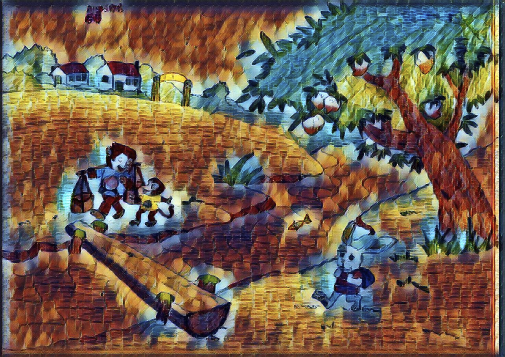

# Use Neural Network for Image Style Transfer

## Evaluations

Evaluate the models built by Logan Engstrom (MIT undergraduate) at his github https://github.com/lengstrom

Our friend Niu Niu. 

|                                                              |                                                              |
| ------------------------------------------------------------ | ------------------------------------------------------------ |
|  |  |
|                    |                    |
|                                                              |                                                              |
|  |  |





```html

```

### Setup

Install TensorFlow https://www.tensorflow.org/install/

TensorFlow Tutorials https://www.tensorflow.org/tutorials/

Machine Learning Tutorials from Google https://developers.google.com/machine-learning/crash-course/ml-intro

- TensorFlow 0.11.0
- Python 2.7.9, Pillow 3.4.2, scipy 0.18.1, numpy 1.11.2
- If you want to train (and don't want to wait for 4 months):
  - A decent GPU
  - All the required NVIDIA software to run TF on a GPU (cuda, etc)
- ffmpeg 3.1.3 if you want to stylize video

### evaluate.py

Need to install some libraries first before run the evaluate.py. 

Most of the lib could be installed using pip install. The moviepy need to install ffmpeg first. 

See the issue and solution on this link https://github.com/lengstrom/fast-style-transfer/issues/129

`brew install ffmpeg`

`pip install --trusted-host pypi.python.org moviepy`

or this: 

```
# install moviepy
sudo pip install moviepy

# install ffmpeg
sudo add-apt-repository ppa:mc3man/trusty-media  
sudo apt-get update  
sudo apt-get install ffmpeg  
sudo apt-get install frei0r-plugins  
```

`evaluate.py` evaluates trained networks given a checkpoint directory. If evaluating images from a directory, every image in the directory must have the same dimensions.

> python evaluate.py --checkpoint ./models/la_muse.ckpt \
>   --in-path ./imgs/ \
>   --out-path ./results/

**Flags**

- `--checkpoint`: Directory or `ckpt` file to load checkpoint from. Required.
- `--in-path`: Path of image or directory of images to transform. Required.
- `--out-path`: Out path of transformed image or out directory to put transformed images from in directory (if `in_path` is a directory). Required.
- `--device`: Device used to transform image. Default: `/cpu:0`.
- `--batch-size`: Batch size used to evaluate images. In particular meant for directory transformations. Default: `4`.
- `--allow-different-dimensions`: Allow different image dimensions. Default: not enabled


References: 

1. https://cs.stanford.edu/people/jcjohns/eccv16/
2. https://cs.stanford.edu/people/jcjohns/papers/eccv16/JohnsonECCV16.pdf
3. https://github.com/jcjohnson/fast-neural-style
4. https://github.com/lengstrom/fast-style-transfer