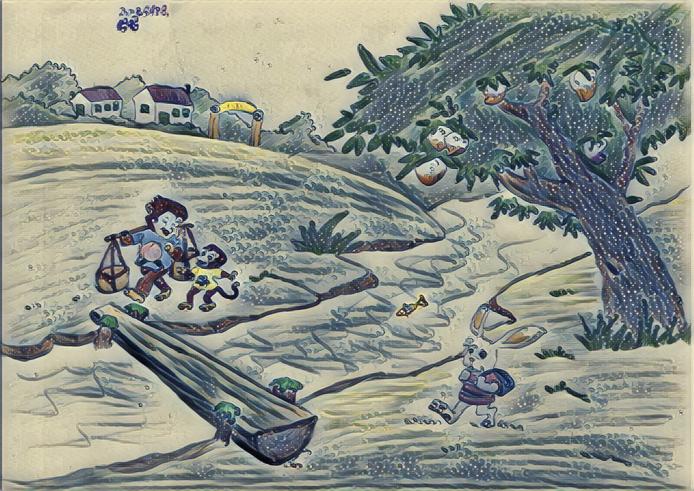

# Use Neural Network for Image Style Transfer

The paper from Gatys (University of Tübingen Germany) demonstrated how to separate the "`Content`" and "`Style`" on an image, and then combine the "`Content`" of one image with the "`Style`" of another image to create a new image. 

https://www.cv-foundation.org/openaccess/content_cvpr_2016/papers/Gatys_Image_Style_Transfer_CVPR_2016_paper.pdf

The key finding is that the representations of `content` and `style` in the Convolution Neural Network are separable. 

### Content

What is the `content` of an image and how to extract the `content`? 

Content is about what objects the image contains.  While the CNN being trained for image object recognition, the image is transformed into a representation that more care about the objects in the image instead of the pixel detail. Along the CNN layering processing sequence, the higher layers have more content focus representation of the image. 

In the image style transfer, we will be using one of the higher layers representation of the image which generated by the CNN image recognition model. In this code example, it is using the image object recognition model VGG19. 

> **vgg19**. Pretrained **VGG-19** convolutional neural network. **VGG-19** is a convolutional neural network that is trained on more than a million images from the ImageNet database. The network is 19 layers deep and can classify images into 1000 object categories, such as keyboard, mouse, pencil, and many animals. [source: https://www.mathworks.com/help/nnet/ref/vgg19.html]

**Note** that only one layer is needed for the content representation and we usually pick the higher layer one. 

### Style

What is the `style` of an image and how to extract the `style`? 

Style is about the texture and the coloring patterns of the image.  

In CNN, there are multiple neural layers. Each neural network layer act as a filter to detect the features and patterns of the image - say find out the big features at the first run, and then find out more smaller features through the next runs. 

While there were some previous researches about using the linear filters and then a set of statistics to present the style and texture of an image, the Gatys has raised a new idea to use the CNN filters and just one statistic (the correlations of all the features representations of those filters) to present the image style and texture. 

**Note** that all the filters on all layers are needed to summarize the image style as each filter extract part of the features/patterns. 

### Generate Image

To generate a new image using one image (say image A) content with another image (say image B) style, that could be formulated as a combined loss function which minimize the sum of error of content differences between new image (say image C) and the original image A, plus the error of style differences between new image C and the style image B. 

### Style transfer algorithm

[source: https://www.cv-foundation.org/openaccess/content_cvpr_2016/papers/Gatys_Image_Style_Transfer_CVPR_2016_paper.pdf]

> 1. First content and style features are extracted and stored. 
> 2. The style image ~a is passed through the network and its style representation A l on all layers included are computed and stored (left). 
> 3. The content image p~ is passed through the network and the content representation P l in one layer is stored (right). 
> 4. Then a random white noise image ~x is passed through the network and its style features G l and content features F l are computed. 
> 5. On each layer included in the style representation, the element-wise mean squared difference between G l and A l is computed to give the style loss L style (left). 
> 6. Also the mean squared difference between F l and P l is computed to give the content loss L content (right). 
> 7. The total loss L total is then a linear combination between the content and the style loss.
> 8. Its derivative with respect to the pixel values can be computed using error back-propagation (middle). This gradient is used to iteratively update the image ~x until it simultaneously matches the style features of the style image ~a and the content features of the content image p~ (middle, bottom).


[Source: https://www.cv-foundation.org/openaccess/content_cvpr_2016/papers/Gatys_Image_Style_Transfer_CVPR_2016_paper.pdf]

## Evaluation 

Evaluate the models built by Logan Engstrom (MIT undergraduate) at his github https://github.com/lengstrom

Our friend Niu Niu. 

|                                                              |                                                              |
| ------------------------------------------------------------ | ------------------------------------------------------------ |
|  |  |
|                    |                    |
|                                                              |                                                              |
|  |  |





```html

```

### Setup

Install TensorFlow https://www.tensorflow.org/install/

TensorFlow Tutorials https://www.tensorflow.org/tutorials/

Machine Learning Tutorials from Google https://developers.google.com/machine-learning/crash-course/ml-intro

- TensorFlow 0.11.0
- Python 2.7.9, Pillow 3.4.2, scipy 0.18.1, numpy 1.11.2
- If you want to train (and don't want to wait for 4 months):
  - A decent GPU
  - All the required NVIDIA software to run TF on a GPU (cuda, etc)
- ffmpeg 3.1.3 if you want to stylize video

### evaluate.py

Need to install some libraries first before run the evaluate.py. 

Most of the lib could be installed using pip install. The moviepy need to install ffmpeg first. 

See the issue and solution on this link https://github.com/lengstrom/fast-style-transfer/issues/129

`brew install ffmpeg`

`pip install --trusted-host pypi.python.org moviepy`

or this: 

```
# install moviepy
sudo pip install moviepy

# install ffmpeg
sudo add-apt-repository ppa:mc3man/trusty-media  
sudo apt-get update  
sudo apt-get install ffmpeg  
sudo apt-get install frei0r-plugins  
```

`evaluate.py` evaluates trained networks given a checkpoint directory. If evaluating images from a directory, every image in the directory must have the same dimensions.

> python evaluate.py --checkpoint ./models/la_muse.ckpt \
>   --in-path ./imgs/ \
>   --out-path ./results/

**Flags**

- `--checkpoint`: Directory or `ckpt` file to load checkpoint from. Required.
- `--in-path`: Path of image or directory of images to transform. Required.
- `--out-path`: Out path of transformed image or out directory to put transformed images from in directory (if `in_path` is a directory). Required.
- `--device`: Device used to transform image. Default: `/cpu:0`.
- `--batch-size`: Batch size used to evaluate images. In particular meant for directory transformations. Default: `4`.
- `--allow-different-dimensions`: Allow different image dimensions. Default: not enabled


References: 

1. https://cs.stanford.edu/people/jcjohns/eccv16/
2. https://cs.stanford.edu/people/jcjohns/papers/eccv16/JohnsonECCV16.pdf
3. https://github.com/jcjohnson/fast-neural-style
4. https://github.com/lengstrom/fast-style-transfer